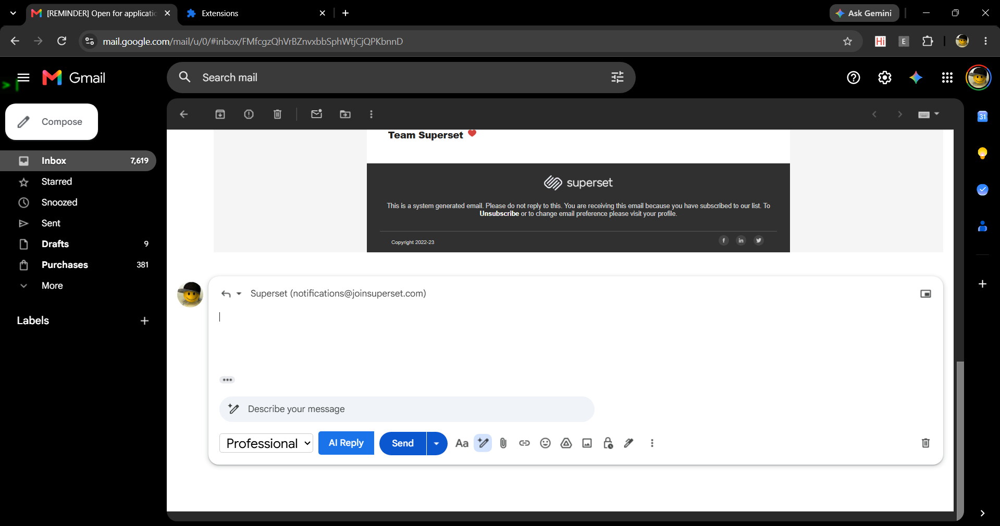
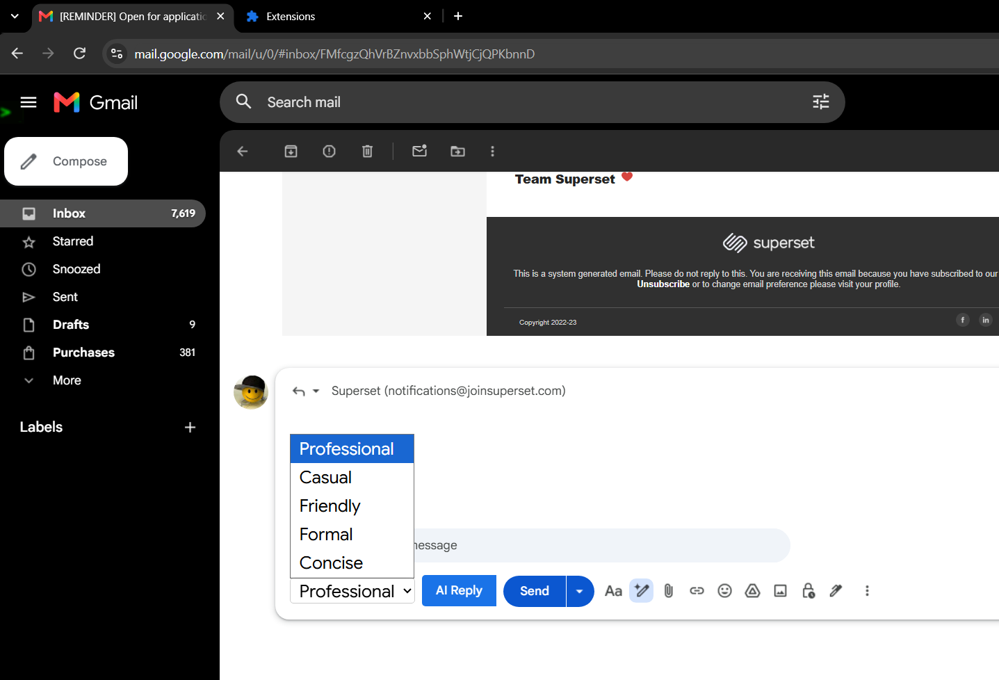
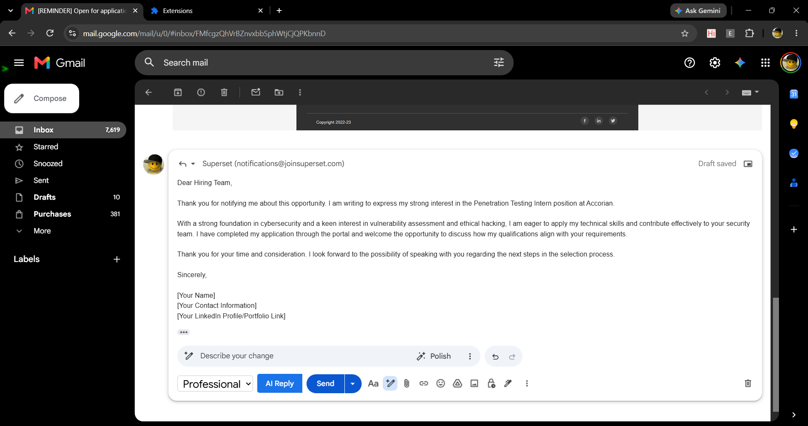

# AI Email Reply Generator

An AI-powered email reply generator built with a Spring Boot backend, a React frontend, and a Chrome extension that integrates directly into Gmail. Generate professional, casual, or friendly email replies in one click — either through a standalone web app or right inside your Gmail compose window.

## ✨ Features

- **AI-generated replies** using Google's Gemini API, based on the original email content and a selected tone
- **Standalone web app** to paste an email, pick a tone, and generate a reply
- **Chrome extension** that injects an "AI Reply" button directly into Gmail's UI, styled to match Gmail natively
- One-click **copy to clipboard** / auto-insert into the Gmail compose box
- Configurable tone: professional, casual, friendly (easily extendable)

## 🛠️ Tech Stack

**Backend**
- Java, Spring Boot
- Spring WebFlux (`WebClient`) for calling the Gemini API
- Lombok
- Google Gemini API for reply generation

**Frontend**
- React (Vite)
- Material UI (MUI)
- Axios

**Chrome Extension**
- Manifest V3
- Vanilla JavaScript (content scripts)
- `MutationObserver` to detect Gmail compose/reply windows dynamically
- DOM injection to blend the AI Reply button into Gmail's native UI

## 🏗️ Architecture

┌─────────────────┐ ┌──────────────────┐ ┌─────────────────┐
│ React Web App │ │ Chrome Extension │ │ Gmail (DOM) │
│ (standalone UI) │ │ (content.js) │────▶│ compose window │
└────────┬─────────┘ └────────┬─────────┘ └─────────────────┘
│ │
└───────────┬────────────┘
▼
┌─────────────────────┐
│ Spring Boot REST API │
│ POST /api/email/generate │
└──────────┬───────────┘
▼
┌─────────────────────┐
│ Google Gemini API │
└─────────────────────┘

## 🚀 Getting Started

### Prerequisites
- Java 17+
- Node.js & npm
- A Google Gemini API key ([get one here](https://ai.google.dev/))
- Google Chrome (for the extension)

### 1. Backend Setup
```bash
cd email-writer-sb
# Set environment variables
export GEMINI_API_URL=<your-gemini-api-url>
export GEMINI_API_KEY=<your-gemini-api-key>

./mvnw spring-boot:run
```
Backend runs on `http://localhost:8080`.

### 2. Frontend Setup
```bash
cd email-writer-react
npm install
npm run dev
```

### 3. Chrome Extension Setup
1. Go to `chrome://extensions`
2. Enable **Developer mode**
3. Click **Load unpacked**
4. Select the `email-writer-extension` folder
5. Open Gmail, click **Reply**, and use the **AI Reply** button

## 📡 API Reference

**POST** `/api/email/generate`

Request body:
```json
{
  "emailContent": "string",
  "tone": "professional | casual | friendly"
}
```

Response: generated reply as plain text.

